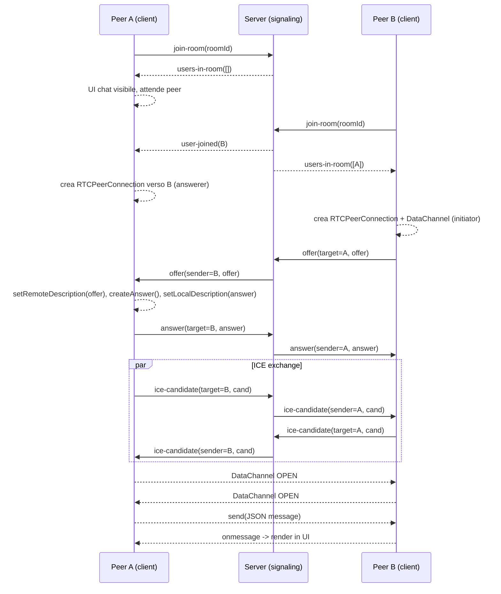

## WebRTC Chat – Flusso completo tra client (`public/app.js`) e server (`server.js`)

Questo documento descrive in dettaglio come l'applicazione gestisce il signaling (via Socket.IO) e la connessione P2P (via WebRTC) per la chat tramite `RTCDataChannel`.

- **Client**: `public/app.js` – UI, Socket.IO client, WebRTC (`RTCPeerConnection`, `RTCDataChannel`).
- **Server**: `server.js` – Signaling server (Express + Socket.IO). Non inoltra i messaggi di chat: solo signaling (offer/answer/ICE).


### Architettura e responsabilità
- **Signaling (server)**: si comporta come un “centralino” che mette in contatto i browser solo nella fase iniziale. Mantiene una `Map roomId → Set(socketId)` per sapere chi si trova in quale stanza e inoltra gli eventi di `user-joined`, `offer`, `answer`, `ice-candidate`, `user-left` al destinatario corretto. Non "legge" né trasporta i messaggi della chat: fa esclusivamente da postino dei metadati necessari a far incontrare i peer.
- **Client (app)**: è il vero protagonista. Gestisce la UI (pulsanti, input, messaggi), tiene lo stato dell'app (stanza corrente, peer connessi, stato connessione), crea una `RTCPeerConnection` per ogni altro utente nella stanza, scambia con loro le informazioni tecniche (SDP, ICE) attraverso il server e, una volta che i due browser si "vedono" in rete, apre un `RTCDataChannel` per lo scambio diretto dei messaggi.


### Flusso: Peer A entra nella home, inserisce `roomId` e clicca “Entra”
1) Il client inizializza l'app al caricamento della pagina.

Quando l'utente apre la home, il browser carica l'HTML, il CSS e lo script `public/app.js`. Alla fine del caricamento del DOM, istanziamo la classe `WebRTCChat`. Questa istanza si occupa di agganciare gli elementi dell'interfaccia, predisporre i listener per i pulsanti e preparare tutte le strutture interne (mappe delle connessioni, flag di stato). In pratica, da questo momento l'app è pronta ad accettare l'azione dell'utente: inserire un `roomId` e cliccare su "Entra".

```javascript
// public/app.js (lines 568-572)
document.addEventListener("DOMContentLoaded", () => {
  new WebRTCChat();
});
```

2) La UI registra i listener; al click su “Entra” chiama `entraInStanza()` che:
- crea la connessione Socket.IO al nostro server di signaling, stabilendo un canale in tempo reale per l'interscambio degli eventi;
- registra tutti i listener degli eventi Socket.IO (come `user-joined`, `users-in-room`, `offer`, `answer`, `ice-candidate`), così da essere pronta a reagire a ciò che manda il server;
- emette `join-room` con il `roomId`, che è il "biglietto" con il quale chiediamo al server di farci entrare nella stanza desiderata e farci conoscere agli altri partecipanti.

```javascript
// public/app.js (lines 88-101)
this.socket = io();
this.stanzaCorrente = roomId;
this.impostaEventiSocket();
this.socket.emit("join-room", roomId);
```

3) Il server riceve `join-room`, inserisce il socket nella stanza, avvisa gli altri (se presenti) e manda ad A la lista utenti già presenti (escludendo A):

Appena riceve la richiesta, il server compie tre azioni ben precise: (a) inserisce il client nella stanza logica di Socket.IO, (b) aggiorna la propria mappa `rooms` per tenere traccia di chi è connesso, (c) avvisa gli altri utenti della stanza che è arrivato un nuovo partecipante con l'evento `user-joined`. Infine, per aiutare il nuovo arrivato a capire chi c'è già, gli invia `users-in-room` con l'elenco degli altri socket già presenti.

```javascript
// server.js (lines 46-80)
socket.on("join-room", (roomId) => {
  socket.join(roomId);
  if (!rooms.has(roomId)) rooms.set(roomId, new Set());
  rooms.get(roomId).add(socket.id);
  socket.to(roomId).emit("user-joined", socket.id);
  const usersInRoom = Array.from(rooms.get(roomId)).filter((id) => id !== socket.id);
  socket.emit("users-in-room", usersInRoom);
});
```

4) Lato client A:
- all'evento `connect`, l'app capisce che il canale di signaling è attivo e aggiorna il badge di stato. Questo non significa ancora che esista una connessione P2P, ma solo che possiamo dialogare col server;
- all'evento `users-in-room`, A scopre chi è già presente. Se l'elenco è vuoto, significa che A è il primo nella stanza: la UI passa in modalità "in attesa di peer" e mostra la chat pronta, ma senza connessioni stabilite.

```javascript
// public/app.js (lines 112-121)
this.socket.on("connect", () => {
  this.aggiornaStato("connected", "Connesso al server di signaling");
});
```

```javascript
// public/app.js (lines 143-153)
this.socket.on("users-in-room", (users) => {
  users.forEach((userId) => this.creaConnessionePeer(userId, true));
  this.aggiornaConteggioPeer();
  this.mostraInterfacciaChat();
});
```

```javascript
// public/app.js (lines 550-558)
this.contenitoreChat.style.display = "block";
this.spanStanzaCorrente.textContent = this.stanzaCorrente;
this.aggiornaStato("connected", "Nella stanza - Aspettando connessioni peer...");
this.isConnected = true;
```


### Flusso: Peer B entra subito dopo nella stessa stanza
1) B segue lo stesso step 2, emettendo `join-room`.

Il secondo utente ripete il gesto di A: inserisce lo stesso `roomId` e clicca. Anche per lui si apre una connessione Socket.IO e viene inviato l'evento `join-room`. Dal punto di vista del server, questa è la notifica che un nuovo membro sta entrando nella stessa stanza di A.

2) Il server:
- aggiunge B alla stanza e aggiorna le sue strutture dati;
- emette a tutti gli altri nella stanza `user-joined` con l'id di B, in modo che A venga informato del nuovo arrivo e possa predisporre una connessione verso di lui;
- invia a B la lista `users-in-room` contenente A, così che B sappia a chi collegarsi e in quale ruolo.

```javascript
// server.js (lines 66-80)
socket.to(roomId).emit("user-joined", socket.id);
const usersInRoom = Array.from(rooms.get(roomId)).filter((id) => id !== socket.id);
socket.emit("users-in-room", usersInRoom);
```

3) Lato client A: riceve `user-joined(B)` e crea una `RTCPeerConnection` verso B come answerer (non iniziatore, attende offer) e aggiorna il conteggio peer.

Essendo A già presente nella stanza, adotta il ruolo di "answerer": prepara la sua `RTCPeerConnection` ma non crea il `DataChannel`. Resterà in ascolto dell'offerta SDP di B. In parallelo aggiorna la UI (ad esempio il contatore dei peer connessi) per rispecchiare il nuovo stato.

```javascript
// public/app.js (lines 121-134)
this.socket.on("user-joined", (userId) => {
  this.creaConnessionePeer(userId, false);
  this.aggiornaConteggioPeer();
});
```

4) Lato client B: riceve `users-in-room([A])` ed è l'iniziatore verso A.
- Crea `RTCPeerConnection`.
- Crea `RTCDataChannel`.
- Genera `offer` (SDP) → `setLocalDescription` → invia `offer` a A via signaling.

In qualità di "initiator", B fa il primo passo della negoziazione SDP: oltre a istanziare la connessione, crea anche un `RTCDataChannel` che verrà negoziato automaticamente come parte dello scambio SDP. Con `createOffer()` descrive le proprie capacità (codec, estensioni, canali) e le invia ad A tramite il server di signaling.

```javascript
// public/app.js (lines 193-214)
const peerConnection = new RTCPeerConnection({
  iceServers: [
    { urls: "stun:stun.l.google.com:19302" },
    { urls: "stun:stun1.l.google.com:19302" },
  ],
});
let dataChannel = null;
if (isInitiator) {
  dataChannel = peerConnection.createDataChannel("messages", { ordered: true });
  this.impostaDataChannel(dataChannel, userId);
}
```

```javascript
// public/app.js (lines 276-289)
if (isInitiator && dataChannel) {
  const offer = await peerConnection.createOffer();
  await peerConnection.setLocalDescription(offer);
  this.socket.emit("offer", { target: userId, offer });
}
```

5) Il server inoltra l'`offer` di B verso A:

Qui il server si limita a consegnare il messaggio al destinatario indicato. È importante notare che non interpreta il contenuto dell'SDP: lo tratta come un payload opaco da consegnare ad A.

```javascript
// server.js (lines 91-98)
socket.on("offer", (data) => {
  socket.to(data.target).emit("offer", {
    offer: data.offer,
    sender: socket.id,
  });
});
```

6) Lato client A: riceve `offer`, crea/recupera la `RTCPeerConnection`, imposta `remoteDescription`, genera `answer`, imposta `localDescription`, invia `answer` a B via signaling.

A completa il secondo passo del rituale SDP: prende l'`offer` di B, la imposta come descrizione remota (così il suo browser conosce le intenzioni/parametri di B), genera una `answer` con i propri parametri compatibili e la imposta come descrizione locale. Infine invia la `answer` indietro a B via server.

```javascript
// public/app.js (lines 156-160)
this.socket.on("offer", async (data) => {
  await this.gestisciOffertaSDP(data.offer, data.sender);
});
```

```javascript
// public/app.js (lines 336-363)
const peerConnection = this.connessioniPeer.get(sender);
if (!peerConnection) {
  await this.creaConnessionePeer(sender);
  const newPeerConnection = this.connessioniPeer.get(sender);
  await newPeerConnection.setRemoteDescription(offer);
  const answer = await newPeerConnection.createAnswer();
  await newPeerConnection.setLocalDescription(answer);
  this.socket.emit("answer", { target: sender, answer });
} else {
  await peerConnection.setRemoteDescription(offer);
  const answer = await peerConnection.createAnswer();
  await peerConnection.setLocalDescription(answer);
  this.socket.emit("answer", { target: sender, answer });
}
```

7) Il server inoltra l'`answer` di A verso B:

Di nuovo, il server recita il ruolo di postino: prende l'`answer` e la consegna al target.

```javascript
// server.js (lines 102-108)
socket.on("answer", (data) => {
  socket.to(data.target).emit("answer", {
    answer: data.answer,
    sender: socket.id,
  });
});
```

8) Lato client B: riceve `answer` e completa la negoziazione settando la `remoteDescription`.

Una volta settata la `remoteDescription` con l'`answer` di A, la parte SDP è conclusa: i due browser hanno una base comune per tentare la connessione di rete vera e propria.

```javascript
// public/app.js (lines 162-167)
this.socket.on("answer", async (data) => {
  await this.gestisciRispostaSDP(data.answer, data.sender);
});
```

```javascript
// public/app.js (lines 389-397)
const peerConnection = this.connessioniPeer.get(sender);
if (peerConnection) {
  await peerConnection.setRemoteDescription(answer);
}
```


### Scambio ICE e apertura DataChannel (stabilizzazione P2P)
1) Entrambi i peer generano ICE candidates e li inviano via signaling all'altro peer:

L'ICE è come una ricerca del percorso migliore per far comunicare due macchine attraverso NAT e firewall. Ogni volta che il browser scopre un possibile "candidato" (un indirizzo/porta/protocollo utilizzabile), lo spedisce all'altro lato tramite il server. È un processo iterativo: più candidati vengono provati finché non se ne trova uno compatibile.

```javascript
// public/app.js (lines 217-225)
peerConnection.onicecandidate = (event) => {
  if (event.candidate) {
    this.socket.emit("ice-candidate", { target: userId, candidate: event.candidate });
  }
};
```

```javascript
// server.js (lines 123-129)
socket.on("ice-candidate", (data) => {
  socket.to(data.target).emit("ice-candidate", {
    candidate: data.candidate,
    sender: socket.id,
  });
});
```

2) Alla ricezione, ciascun peer aggiunge i candidati alla propria connessione:

Quando arrivano candidati dal peer remoto, vengono aggiunti alla `RTCPeerConnection` locale. In questo modo entrambi i lati accumulano alternative di routing. Quando una combinazione funziona, lo stato ICE passa a "connected/completed".

```javascript
// public/app.js (lines 170-174)
this.socket.on("ice-candidate", async (data) => {
  await this.gestisciCandidatoICE(data.candidate, data.sender);
});
```

```javascript
// public/app.js (lines 407-414)
const peerConnection = this.connessioniPeer.get(sender);
if (peerConnection) {
  await peerConnection.addIceCandidate(candidate);
}
```

3) Stato `connection`/`iceConnection` e apertura del `RTCDataChannel`:

Durante e dopo la fase ICE, gli stati della connessione e del sottosistema ICE cambiano più volte. Quando lo stato diventa "connected" e il `DataChannel` va in `open`, significa che il canale P2P affidabile è operativo. Da quel momento i messaggi possono scorrere direttamente tra i browser, senza toccare il server.

```javascript
// public/app.js (lines 245-254)
peerConnection.onconnectionstatechange = () => {
  if (peerConnection.connectionState === "connected") {
    this.aggiornaStato("connected", "Connesso");
    this.isConnected = true;
    this.aggiornaConteggioPeer();
  }
};
```

```javascript
// public/app.js (lines 230-242)
peerConnection.ondatachannel = (event) => {
  const incomingDataChannel = event.channel;
  this.impostaDataChannel(incomingDataChannel, userId);
  peerConnection.dataChannel = incomingDataChannel;
};
```

```javascript
// public/app.js (lines 295-305)
dataChannel.onopen = () => {
  this.aggiornaStato("connected", `Connesso - DataChannel con ${userId.substring(0, 8)} aperto`);
};
```


### Chat: invio e ricezione messaggi (P2P, non passano dal server)
- Invio: il mittente serializza un oggetto con `content`, `sender`, `timestamp` e lo invia su ogni `DataChannel` aperto.

L'invio messaggi è volutamente semplice: si prepara un piccolo oggetto con contenuto, autore e tempo, lo si trasforma in JSON e lo si invia su ciascun `DataChannel` che risulta pronto (`readyState === "open"`). Se ci sono più peer nella stanza, ognuno riceverà una copia.

```javascript
// public/app.js (lines 446-474)
const messageData = {
  content: message,
  sender: this.socket.id,
  timestamp: new Date().toISOString(),
};
this.connessioniPeer.forEach((peerConnection, userId) => {
  if (peerConnection.connectionState === "connected") {
    const dataChannel = peerConnection.dataChannel;
    if (dataChannel && dataChannel.readyState === "open") {
      dataChannel.send(JSON.stringify(messageData));
    }
  }
});
```

- Ricezione: l'altro peer effettua il parse e mostra in UI.

All'arrivo, il messaggio è una stringa JSON: viene convertita in oggetto e passata al renderer della chat che aggiunge un nuovo "bubble" nella lista messaggi, con indicazione dell'autore (il peer abbreviato) e un timestamp leggibile.

```javascript
// public/app.js (lines 307-317)
dataChannel.onmessage = (event) => {
  const message = JSON.parse(event.data);
  this.mostraMessaggio(
    message.content,
    `Peer ${userId.substring(0, 8)}`,
    false
  );
};
```


### Disconnessione e pulizia
- Lato server: rimuove il socket da tutte le stanze, notifica `user-left`, cancella stanza se vuota.

Quando un utente chiude la pagina o perde la connessione, il server riceve l'evento di `disconnect`. Aggiorna la mappa `rooms` per riflettere l'uscita e avvisa i rimanenti peer nella stanza. Se non c'è più nessuno, elimina la stanza per liberare memoria.

```javascript
// server.js (lines 131-147)
socket.on("disconnect", () => {
  rooms.forEach((users, roomId) => {
    if (users.has(socket.id)) {
      users.delete(socket.id);
      socket.to(roomId).emit("user-left", socket.id);
      if (users.size === 0) rooms.delete(roomId);
    }
  });
});
```

- Lato client: chiude e rimuove la `RTCPeerConnection`, aggiorna UI.

L'app lato client reagisce rimuovendo la connessione P2P corrispondente (chiusura della `RTCPeerConnection` e cleanup dei riferimenti), e aggiornando i conteggi e lo stato, così che l'interfaccia rifletta la situazione reale.

```javascript
// public/app.js (lines 137-141)
this.socket.on("user-left", (userId) => {
  this.rimuoviConnessionePeer(userId);
  this.aggiornaConteggioPeer();
});
```


### Sequenza riassuntiva (Mermaid)




### Note operative
- Il server non vede i contenuti dei messaggi chat: il trasporto avviene direttamente P2P sul `RTCDataChannel` e resta nel perimetro dei browser.
- Il primo peer in stanza è tipicamente l'answerer (nel nostro caso hally); il nuovo arrivato agisce da initiator verso gli esistenti (nel nostro caso l'utente che arriva sul sito). In stanze con più utenti, ciascun nuovo ingresso negozia in parallelo con tutti gli altri.
- Gli `iceServers` usati sono STUN pubblici di Google; in ambienti di rete restrittivi (NAT simmetrici, firewall aggressivi) potrebbe essere necessario un server TURN per garantire la raggiungibilità (i server TURN sono dei backup per permettere ai due peer di connettersi comunque).
- `rooms` è una `Map(roomId → Set(socketId))` in memoria del processo Node: per un ambiente di produzione con più istanze o riavvii considerare persistenza esterna e sharding/affinità di sessione (ottimo consiglio chat, ma come? ci penseremo piu avanti...).

